# Dokumentáció

## Játék leirása
A játék elején a felhasználó 1 db C-3PO pakoló robottal, 1 db Voyager töltő robottal, egy 10 férőhelyes raktárral és 20 000 dolláral kezdi meg a játékot. A játék során az a cél, hogy minél nagyobb raktárat és bevételt birtokoljon a játékos. Minden játéknap elején a raktár szabad férőhelyének 60%-ának megfelelő csomag érkezik. Csak addig érkezik csomag, amíg van szabad férőhely a raktárban. A játék során kell fizetni karbantartási költséget is, ami minden nap legelején kerül levonásra. A robotoknál már a vásárlásnál meg van adva, hogy mennyi lesz az adott robot fenntartási költsége. A raktár után is kell fizetni karbantartási díjat, ami a raktár aktuális méretének 30% * 200 $. A játék akkor ér véget, ha a játékos egyenlege mínuszba megy. Ekkor már nem tud semmit csinálni abban a játékban, és újat kell kezdenie.

A csomagoknál két típus van, de azon belül többféle csomag létezik. A csomagtípus és a csomag megnevezése random kerül kiválasztásra a játék során. A csomagok lehetséges elnevezéseit a packages.json tartalmazza.

Az alábbi csomagtípusok léteznek:
- Romlandó csomag
- Nem romlandó csomag

Pakolás során a romlandó csomagok elsőbbséget élveznek, emiatt ezek kerülnek elpakolásra először. A csomagoknál az ár és a pakolási idő is random kerül kiválasztásra. A tárolási idő 1–8 nap között lehet, valamint a csomagok ára 1700$ és 3900$ között mozog. Minél tovább kell tárolni egy csomagot, annál több pénzt kap érte a felhasználó. Az alábbiak szerint módosul a csomag ára:
- 1-3 napig 1 * csomag ára
- 4-7 napig 1,5 * csomag ára
- 8 napig 2 * csomag ára

A játék során a töltő- és pakolórobotokból több fajtát is lehet majd vásárolni.

A pakolórobotokból összesen 6 db van, és azok az alábbiak:
- C-3PO
- Jhonny 5
- Data
- HAL 9000
- Ultron
- T-800

A töltő robotokból összesen 4 db van, és azok az alábbiak:
- Voyager
- ASIMO
- BB-8
- Sonny

A játék során 3 db fajta raktár bővítés közül lehet választani, amik az alábbiak:
- Kis bővítés
- Közepes bővítés
- Nagy bővítés 

A raktár bővítések és a robotok a shop.json-ben vannak eltárolva, hogy a későbbiekben könyen modositható és bövithető legyen.

## Változás az 1. mérföldkőhöz képest:
A játéknál minden meg lett valósítva, ami az első mérföldkő leírásában szerepelt, csak a játékhoz hozzá lett adva egy extra rendszer is, amivel játékbeli trófeákat lehet gyűjteni. Összesen 43 játékbeli trófeát tud szerezni a felhasználó. A játékos a már elindított játékon belül tudja megszerezni ezeket a trófeákat, ami annyit jelent, hogy minden játéknak külön trófearendszere van.

## 1. Megvalósíthatósági elemzés (részletek):
- Humán erőforrások: egy tervező/fejlesztő (45 óra), egy tesztelő (5 óra)
- Hardver erőforrások: egy fejlesztői, egy tesztelői számítógép (közepes hardverigény)
- Szoftver erőforrások: fejlesztőkörnyezet (Visual Studio), verziókövető (Git), adatbáziskezelő (MSSQL)
- Üzemeltetés: a telepítést/átadást követően további üzemeltetést nem kell biztosítani
- Karbantartás: az esetleges hibajavításon felül nem kell biztosítani
- Megvalósítás időtartama 50 emberóra

## 2. Funkcionális követelmények:
- Játékot megelőzően: új játék indítása, korábbi játékállás betöltése vagy kilépés az alkalmazásból
- Játék közben:
  - Aktuális raktár állapot megjelenítése
  - Vásárlás esetén egy vásárlási menü megjelenítésé, ahol robotokat és raktár területet lehet venni.
  - Raktár készlet lekérdezés esetén egy menü megjelenítésé, ahol az áruk adatait lehet megtekinteni.
  - Egy gomb, amivel a következő napra lehet lépni vagy pedig automatikus léptetés bekapcsolása
- Automatikus mentések minden új napnál és manuális mentési lehetőség

## 3. Termék követelmények:
- Hatékonyság:
  - jelentéktelen terhelés a processzor, memória és háttértár részére, hálózatot nem igényel
  - gyors (1 másodperc alatti) válaszidő minden bevitelre egy alsó kategóriás számítógépen
- Megbízhatóság:
  - szabványos használat esetén nem fordul elő hibajelenség, nem jelenik meg hibaüzenet
  - hibás emberi bevitel esetén hibaüzenet és a bevitel megismétlése
- Biztonság: nem releváns
- Hordozhatóság: a legtöbb személyi számítógépen biztosított a használat
- Felhasználhatóság:
  - intuitív felhasználói felület, külön segédlet, vagy leírás nem szükséges a használathoz

## 4. Menedzselési követelmények:
- Környezeti:
  - nem működik együtt semmilyen külső szoftverrel vagy szolgáltatással, az adatokat lokális adatbázisban tárolja
- Fejlesztési:
  - C# nyelv, Visual Studio környezet, objektumorientált paradigma

## 5. Felhasználói történet
**Mint játékos szeretnék új robotot vásárolni.**
1. Amennyiben a robot vásárlás menüpontot választottuk, ha kiválasztjuk a robotot amelyiket szeretnénk és rendelkezésre áll elegendő pénz, akkor a program hozzá adja a robotot a raktárhoz és visszatér a vásárlási menübe.
2. Amennyiben a robot vásárlás menüpontot választottuk, ha kiválasztjuk a robotot amelyiket szeretnénk és nem áll rendelkezésre elegendő pénz akkor a program egy hiba üzenetet jelenít meg majd visszatér a vásárlási menübe.

**Mint játékos szeretnék a következő napra lépni.**
1. Amennyiben a következő nap gombra rányomtunk, ha rendelkezésre áll elegendő pénz a karbantartási költségek fizetésére, akkor a program a következő napra lép és levonja a karbantartási költségeket.
2. Amennyiben a következő nap gomra rányomtunk, ha nem áll rendelkezésre elegendő pénz a karbantartási költségek fizetésére, akkor a program befejezi a játékot és megjelenít egy összesítő felületet, ahol meg tekinthe a játékos a játék során elért eredményeit.

## 6 Használati esetek diagram
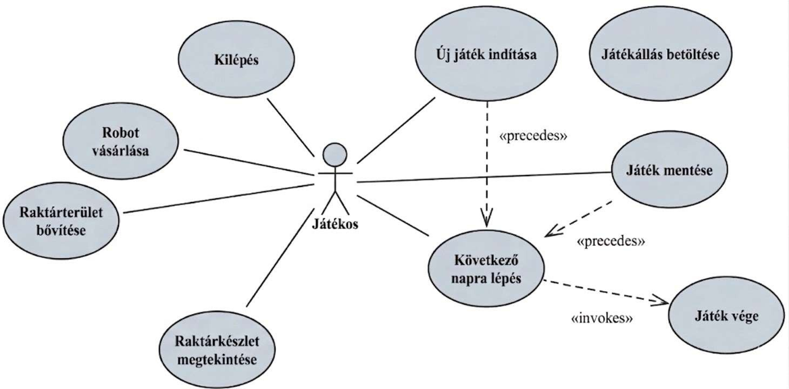

## 7 Osztály diagram
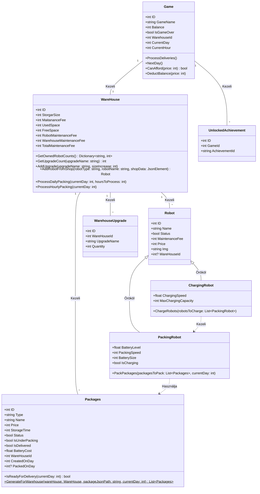

## 8 Adatbázis diagram
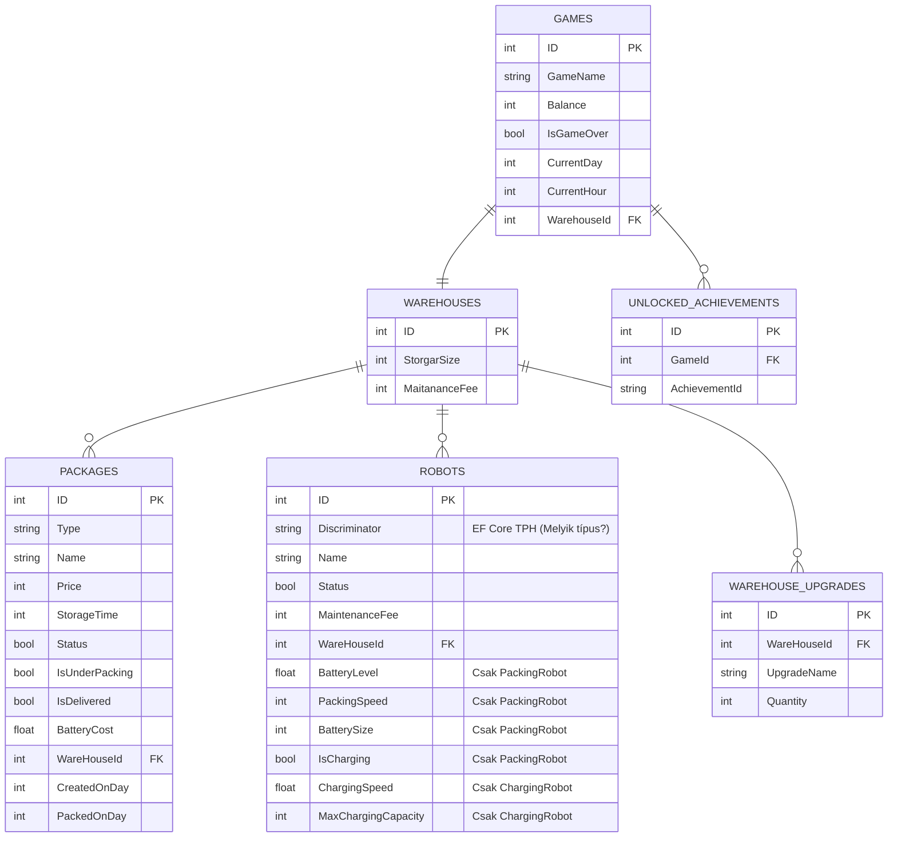
## 9 Komponens diagram

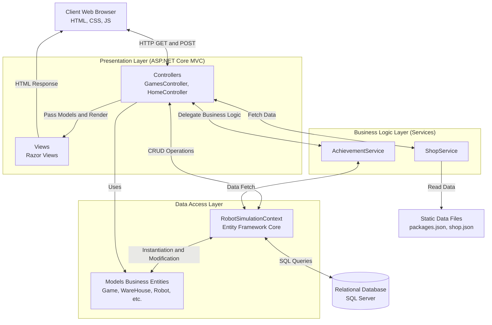
## 10 Állapotdiagramok (State Diagrams)

### 1. Aggregált állapotdiagram

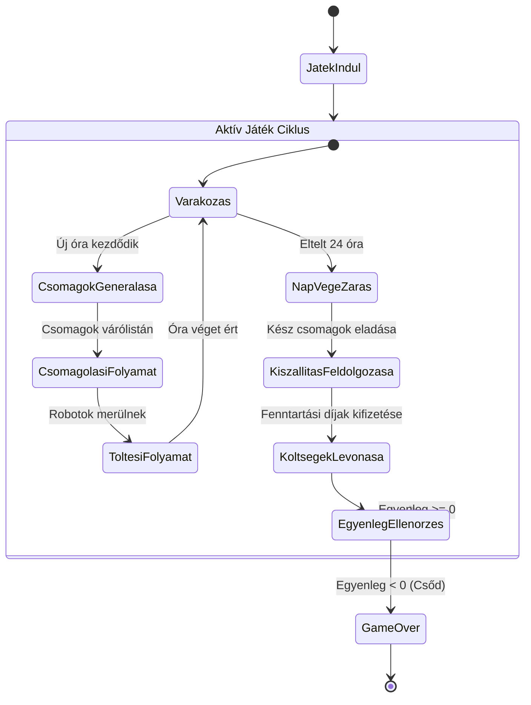

## 2. Részekre bontott Állapotdiagramok

### 2.1 Csomag állapotai
Egy csomag életútja a generálástól a kiszállításig.

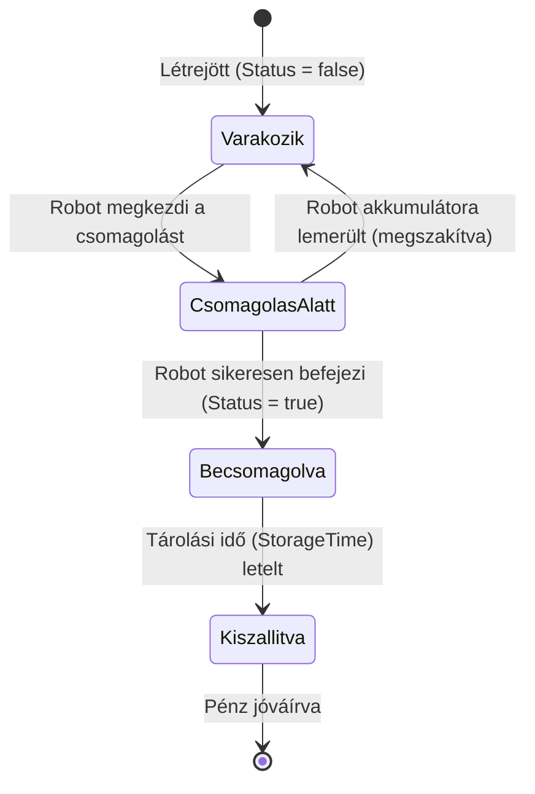

### 2.2 Csomagoló Robot állapotai
A csomagoló robot munka és töltés közbeni állapotai.

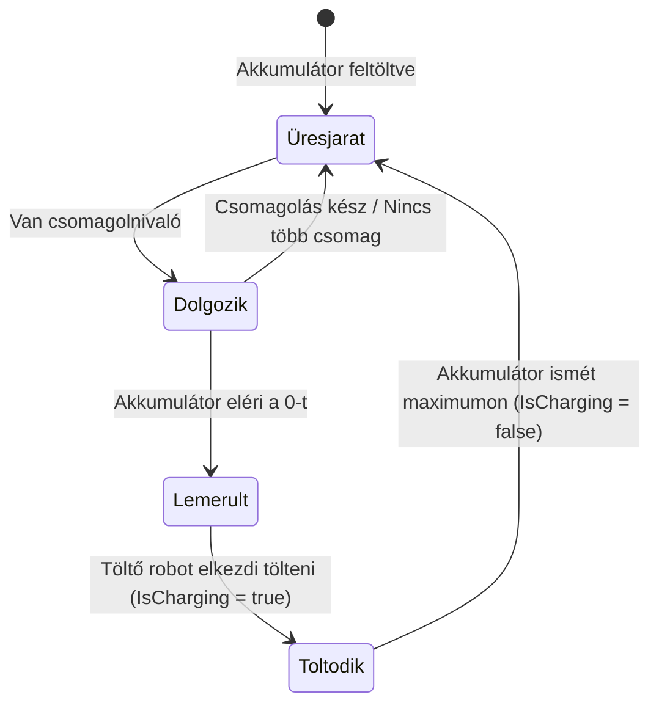

### 2.3 Játék állapotai
A játékmenet egyszerűsített állapota.

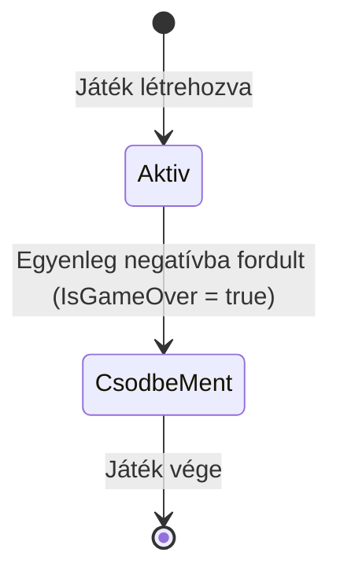
## 11 Szekvencia Diagramok

## 1. A Játék Ciklusa 
Ez a diagram azt mutatja be, hogy mi történik a háttérben, amikor a játékos elindítja a játékot, és az idő elkezd telni.

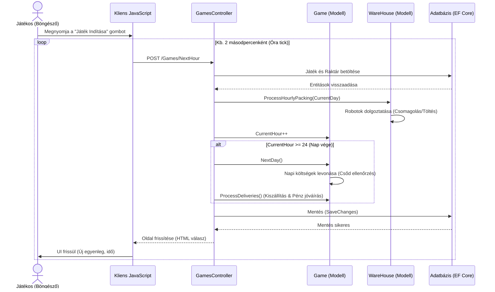

## 2. Robot vásárlása a boltban
Ez a diagram a vásárlás folyamatát és ellenőrzését mutatja be.

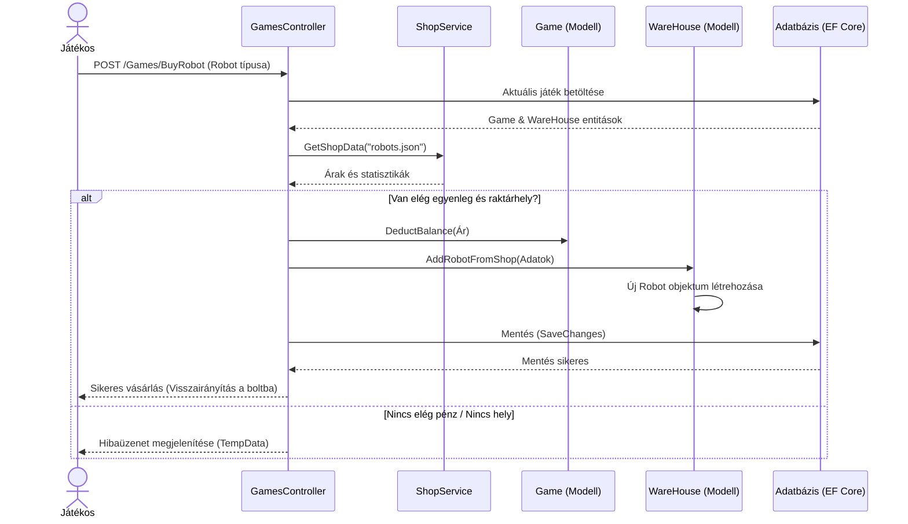

## 3. Trófeák ellenőrzése
Ez a folyamat a háttérben fut aszinkron módon, hogy megvizsgálja, elért-e valamilyen trófeát a játékos.

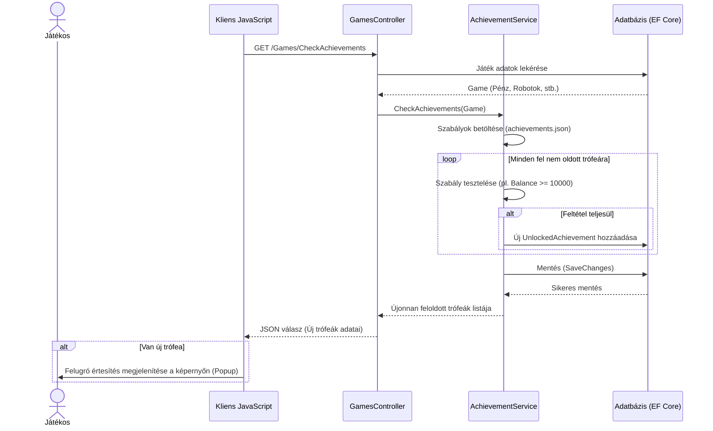